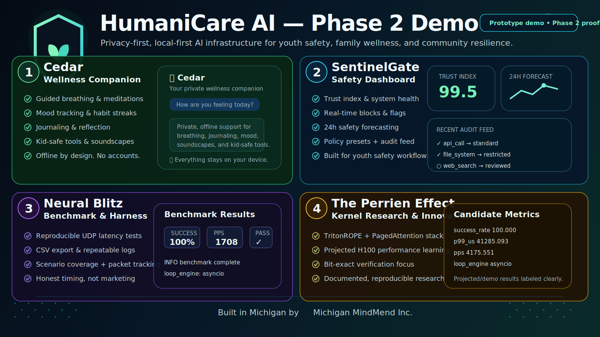

  

# Michigan MindMend Inc.

**HumaniCare AI** — privacy-first, local-first AI infrastructure for youth safety, family wellness, healthcare access, and community resilience.

Built in Michigan by **Lyle Perrien II**.

**Phase 1 complete.** Clear mission, safety boundaries, core repos, and sponsor-ready framing.  
**Phase 2 underway.** Demo proof, production hardening, local model paths, and real-world partner feedback.

## The System

HumaniCare AI connects:

- **OpenClaw Empathy Anchor** — core empathy and safety module
- **MindMend Guardian** — youth and family safety workflows
- **TrustLayer** — LLM safety gateway: PII redaction, jailbreak detection, audit logging
- **MindMend Vault** — local-first support and audit-log scaffold

The goal is not to replace clinicians, parents, or trusted humans. The goal is to build safer support infrastructure that protects privacy and routes risk responsibly.

## Core Values

- Privacy over harvesting
- Human judgment over blind automation
- Offline capability where possible
- Clear medical, crisis, and safety boundaries

## Phase 2 Priorities

- Short demo videos and screenshots
- Stronger tests, CI, and threat models
- Local model integration: Ollama / llama.cpp
- Raspberry Pi / edge deployment notes
- Real-world partner feedback

**Built in Michigan. Human-first. Privacy-first.**

**Lyle Perrien II**  
Founder, Michigan MindMend Inc.  
Owosso, Michigan  
[@p_perrien](https://x.com/p_perrien) | michiganmindmendinc@proton.me
